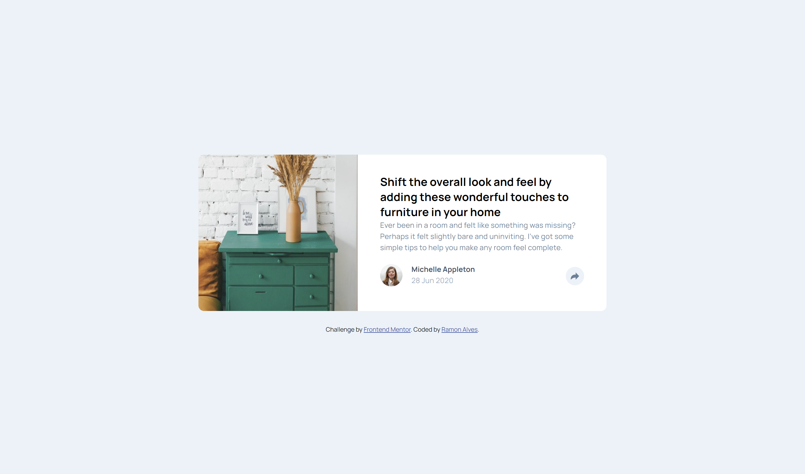
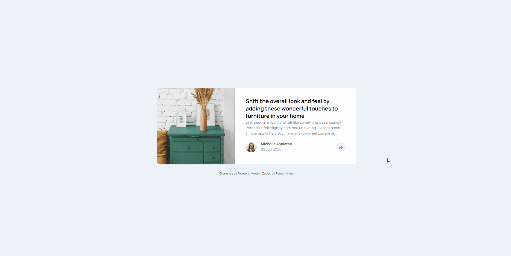
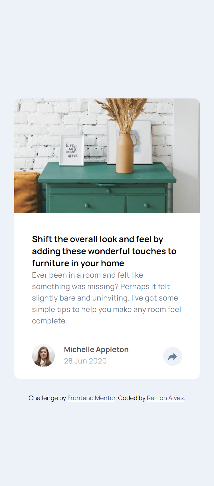
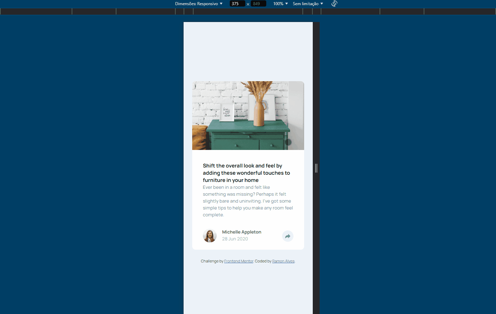
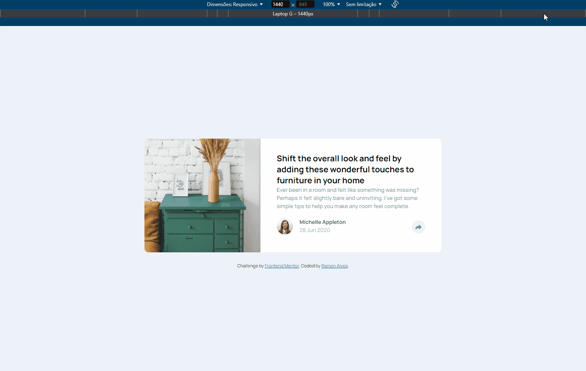

# Frontend Mentor - Article preview component solution

This is a solution to the [Article preview component challenge on Frontend Mentor](https://www.frontendmentor.io/challenges/article-preview-component-dYBN_pYFT). Frontend Mentor challenges help you improve your coding skills by building realistic projects. 

## Table of contents 📖

- [Overview](#overview)
  - [The challenge](#the-challenge)
  - [Screenshot](#screenshot)
  - [Links](#links)
- [My process](#my-process)
  - [Built with](#built-with)
  - [What I learned](#what-i-learned)
  - [Continued development](#continued-development)
- [Author](#author)

## Overview 🔭

### The challenge 🏆

Users should be able to:

- View the optimal layout for the component depending on their device's screen size
- See the social media share links when they click the share icon

### Screenshot 🎴

#### Desktop Preview

#### Desktop Active States

#### Mobile Preview

#### Mobile Active States

#### Responsivity

### Links 🔗

- Solution URL: [Frontend Mentor - Challenge Solution](https://www.frontendmentor.io/solutions/article-preview-yyfF-yXgLr)
- Live Site URL: [Site](https://ramon-alvez.github.io/FrontEnd-Mentor-Article-preview/)

## My process 💻✒

### Built with 🧱🛠

- Semantic HTML5 markup
- CSS custom properties
- Flexbox

### What I learned 📚

The challenge was very easy until I had to create the sharing section, this part gave me so much trouble that I was even disappointed to have done the script in 2 minutes 😅😂😂

Well, I know that my script isn't a thing to be proud, but for now that is the way I choose to solve this problem, but I'm looking forward to improve my problem solve capacity. 

Other thing I want to punctuate here is in CSS, I know I could have used GRID to solve this challenge but when I thought that I was ending the page stylization 😅, I'm just so used to Flexbox but I will try to use GRID more in the future.

### Continued development 🚀

Now my plan is to practice JS with Frontend Mentor challenges and continue studying React

## Author 🧙‍♂️

- GitHub - [Ramon Alvez](https://github.com/Ramon-Alvez)
- Frontend Mentor - [@Ramon Alvez](https://www.frontendmentor.io/profile/Ramon-Alvez)
- LinkedIn - [@Ramon Alvez](https://www.linkedin.com/in/ramon-alvez/)
